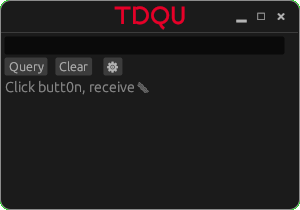

ccntool
=======

This repository is intended to be used with [openDCIM](https://opendcim.org)
and can be used to query the database to get information about a certain
network wallsocket.

The user has to input a wallsocket description (hardcoded for our usecase) and
the query will return the switch name, switch ip, specific switch port and its
description.
It can be used as a quick glance on what configuration you can expect from a
wallsocket port as well as to prepare information to pass on to the second
level support.

The project is divided in a library, `ccntool_core` which provides commonly
shared functions between different frontends.
You get to choose between `ccntool_cli`, `ccntool_tui` and `ccntool_gui`.
The most polished version is `ccntool_gui`, others may or may not be expanded
in the future.

Because of its very specific use-case this code is not published to
[crates.io](crates.io).
If there is any actual demand for that please open a ticket.

## 🛍️ Installation

You need at least rust version 1.67 to compile this project installed.
Tested and proven working on both Windows and Linux workstations,
probably on macOS too.

1. `git clone https://github.com/hs-duesseldorf/ccntool.git`
2. `cd ccntool`
3. `cargo build --release`

## 🛠️ How to use


### Connecting the tool to the database
You need a working openDCIM installation (mainly for its database) and
connectivity to it to use these tools.
It is not intended to replace your database, but to give you a very specific
view on your data to aid in first and second level which include a wall
socket connected to a switch.

All frontends can be configured via environmental flags or a file called
`.env` next to the executable.
The GUI can be configured from within itself at runtime, too.

The name `dcim` for the database is currently hardcoded.

```
DCIMHOST=dcim.my.tld
DCIMUSER=user
DCIMPASSWORD=password
```

### Getting information

On both the CLI and TUI you are expected to input a valid wallsocket
description, there is no further help.
The GUI queries all ports after being configured and offers a list of all
valid queries as a dropdown menu.

## 🗺️ Roadmap

In the future, this tool aims to use REST calls to provide more information
about a port.

If possible, it would be nice to compile a working web application from
the gui.

Reporting specific wallports for review via email/teams-api/.. would be nice.

## 📷 Screenshots


### CLI
to be added

### TUI
to be added
### GUI

## ⚠️ Caveats

As noted above, the regex used is very specific to our use case and will need
to be changed.

Your openDCIM installation will need to have switches deployed which are
connected to patchpanels that finally are connected to wallsockets.
The wallsocket description is part of the notes field of a patchpanel, which
is the identifier used as user input on all frontends.

## 🤝 Contribution

If you do happen to use this tool, feel free to participate.
Tickets and pullrequests are welcome.

## 📝 License

This project is licensed under [MIT license](https://github.com/hs-duesseldorf/ccntool/blob/main/LICENSE)
except for its assets.
The file `HSDSans-Regular.ttf` is owned by [HS Düsseldorf](https://hs-duesseldorf.de)
and permission was granted to use it for this project.
If you do want to use this font, please seek permission there.
